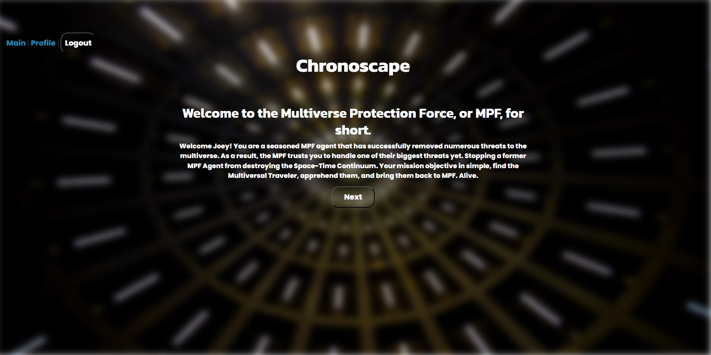
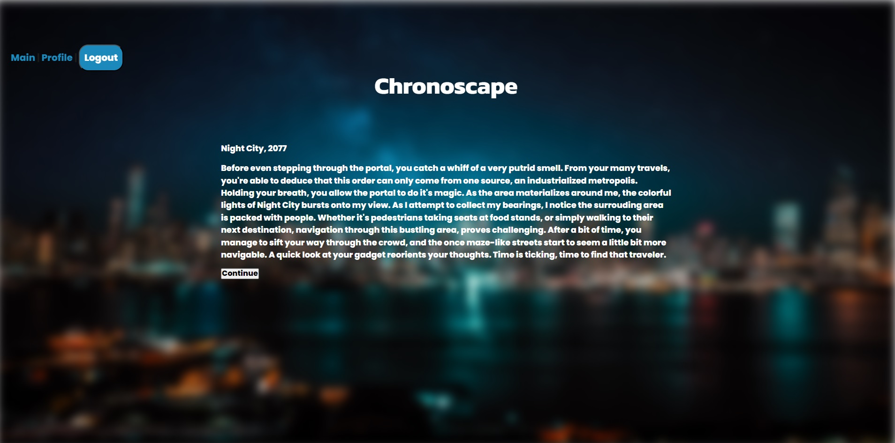
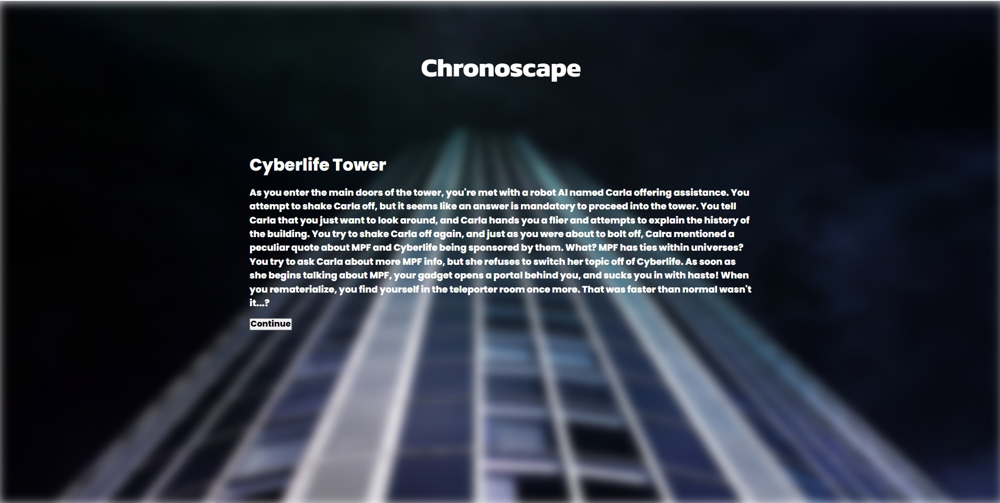
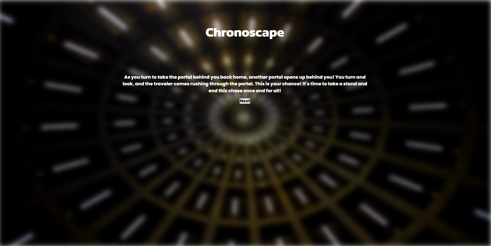

# ChronoScape

## Description

Welcome to the Multiverse Protection Force. As an agent of MPF, you will be tasked with protecting the multiverse from any threats that will try to harm it. This means ensuring that events happen as they should, and apprehending anyone who may be considered a universal threat. You are a seasoned MPF agent that has successfully removed numerous threats to the multiverse. As a result, the MPF trusts you to handle one of their biggest threats yet. Stopping a former MPF Agent from destroying the Space-Time Continuum Your mission objective in simple, find the Multiversal Traveler, apprehend them, and bring them back to MPF. Alive.

ChronoScape is a choose your path game that has over 40 locations to travel to. Explore the dangerous city of Gotham, or pay a visit to the Village Hidden in the Leaves. It's your path to choose, just don't forget your mission.

ChronoScape currently has 4 endings, 3 bad ones and 1 good one. During your travels, you'll have 3 chances to get points. You can either obtain a MPF point, a Traveler point, or a Void point, you won't know which path gives you which point though. Try your best to get the good ending, which is obtained by having 1 of each point!

Good luck agent, you'll need it.

## Installation

https://github.com/jmcmillenmusic/chronoscape - Repo Page

You can download our repo from our repo page using the following command in git bash

"git clone git@github.com:jmcmillenmusic/chronoscape.git"

or you can visit our page below

https://chronoscape-g3-dd74e8283e15.herokuapp.com/ - Deploy Page

## Credits

Anime.Js - https://animejs.com/

Google Fonts - https://fonts.google.com/

Pexels - https://www.pexels.com/api/

UTA Class Repo

## License

https://github.com/liq543/Park-Safe/blob/main/LICENSE - MIT License